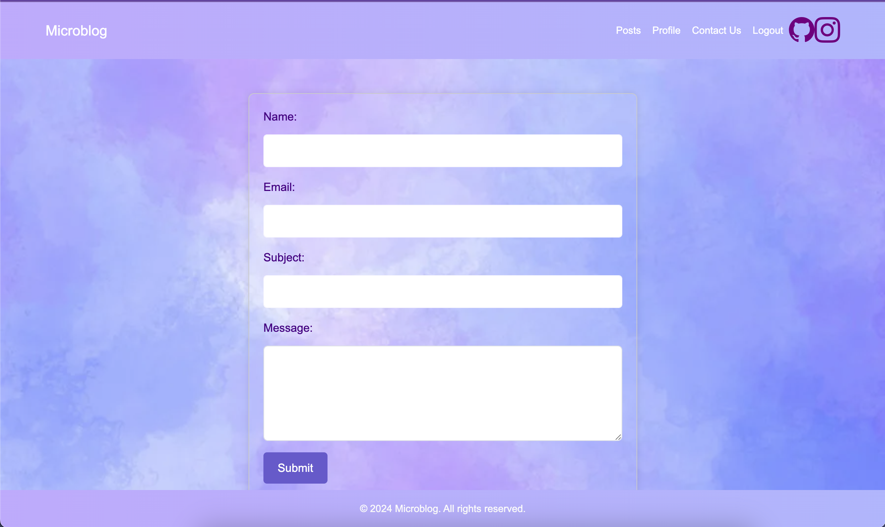
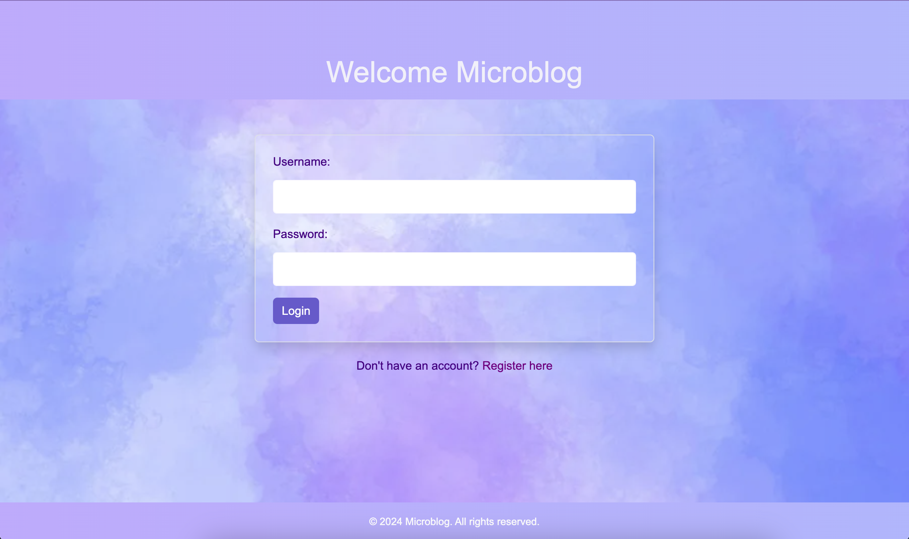
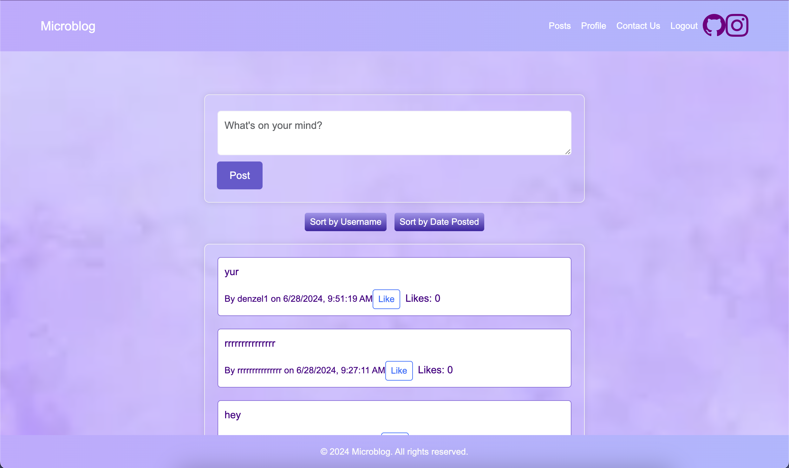
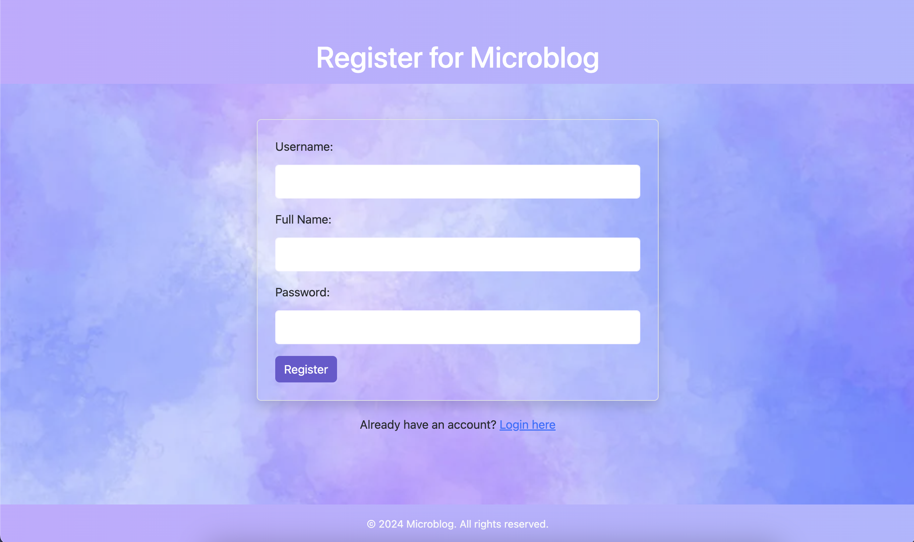

# Microblog

Microblog is a lightweight blogging platform with basic CRUD operations for posts and user interaction.

## Features

- **User Authentication**: Register, login, and logout functionalities.
- **Post Management**: Create and view posts.
- **Like/Unlike Posts**: Ability to like or unlike posts.
- **Sorting**: Sort posts by username or date posted.
- **Responsive Design**: Mobile-friendly and visually appealing interface.

## Technologies Used

- **Frontend:** HTML, CSS, JavaScript
- **Backend:** MicroplogAPI


## Installation

1. **Clone the repository:**
   ```bash
   git clone https://github.com/your-username/microbloglite.git
   cd microblog

## Screenshots

### Contact Page


### Login Page


### Post Page


### Register Page
